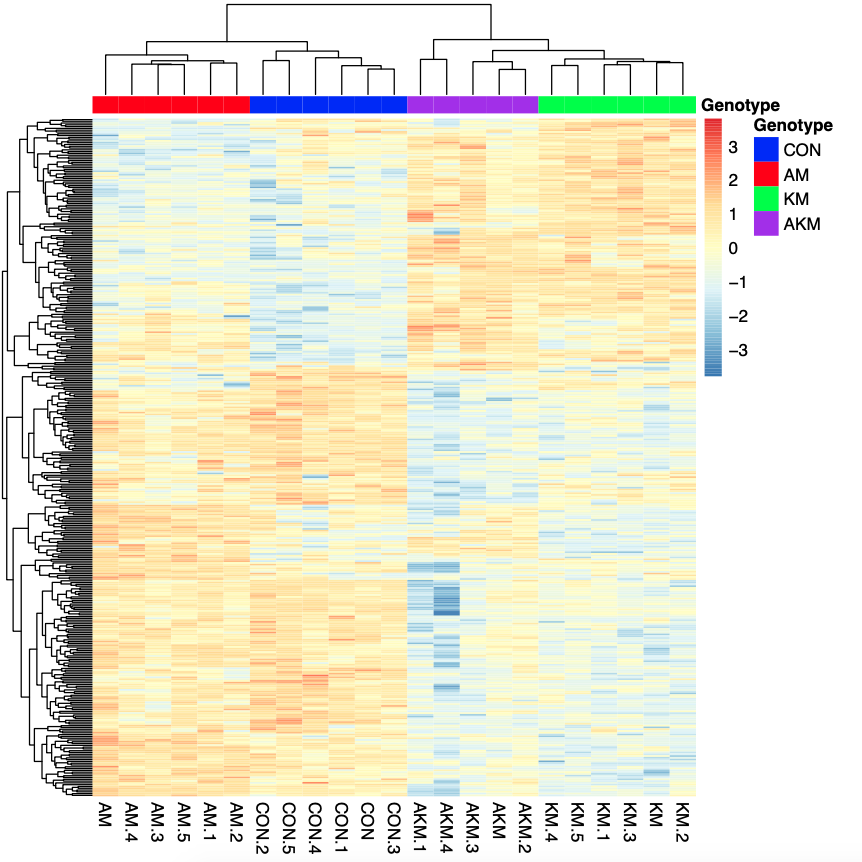
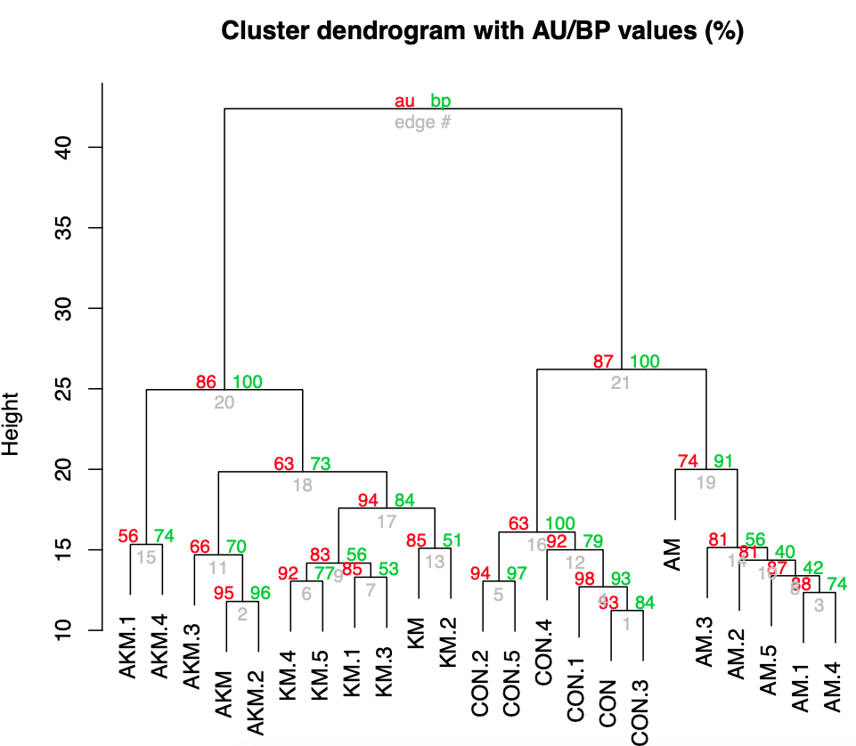

Approximately 21,000 new cases of acute myeloid leukemia (AML) was diagnosed in 2019 in the US alone (NIH). Somatic mutations are acquired sequentially in AML development. Some mutations are early events arising in the heamatopoietic stem cells (HSCs) while other mutations are late events. In this study, Di Genua et al investigated the effect of Aml1-ETO fusion gene and Kras-G12D mutation in murine HSCs, either individually or in combination. Here, I assisted in the bioinformatics analysis of RNA-sequencing data derived from CD45.2 LSK (Lin-Sca1+Kit+) CD150+ Flt3– cells from competitively transplanted recipients. We demonstrated distinct gene expression signatures across these cells with different genetic mutations. Full report on this study has been published here: http://www.haematologica.org/content/104/11/2215.long

